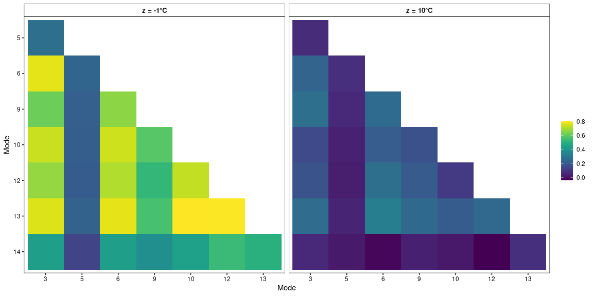

# Estimation of the Conditional Mean, Covariance and Correlation of the Frequency Data from Railway Bridge KW51

This code provides the estimation of the conditional covariance as
presented in **“Confounder-adjusted Covariances of System Outputs and
Applications to Structural Health Monitoring”** by L. Neumann, P.
Wittenberg, A. Mendler, and J. Gertheiss ([Neumann et al.
2024](#ref-Neumann.etal_2024))

<!-- **TODO: indicates you can choose or change a variable or method to compare, e.g., -->
<!-- different bandwidths or methods for estimating the conditional -->
<!-- mean.**  -->

This code contains estimation of the Nadaraya-Watson type kernel
estimation of the conditional mean and covariance and different
estimations of the conditional mean (bilinear, gam, loess, kernel) of
the modal data of the railway bridge KW51.

Contact for questions: Lizzie Neumann, neumannl(at)hsu-hh.de

## The covest R-package

Describe what the R-package is for and what it does. Provide
installation instructions.

The package compiles C++ source code during installation, therefore you
need the appropriate compilers:

On *Windows* you need
[Rtools](https://cran.r-project.org/bin/windows/Rtools/) available from
CRAN.

On *macOS* you need the Clang 6.x compiler and the GNU Fortran compiler
from [macOS tools](https://cran.r-project.org/bin/macosx/tools/). Having
installed the compilers, you need to open a terminal and start R via
‘PATH=/usr/local/clang6/bin:\$PATH R’. You can then install the package
via *devtools::install_github(“neumannLizzie/conditional-covariance”)*

## Load libraries

``` r
install.packages("librarian")
```

    ## Installing package into '/home/pwitten/R/x86_64-pc-linux-gnu-library/4.2'
    ## (as 'lib' is unspecified)

``` r
## also include the github repo for R-package "covest" hosted on github: neumannLizzie / conditional-covariance
librarian::shelf(covest, dplyr, ggplot2, mgcv, patchwork, pracma, R.matlab, segmented, stats, tidyr, viridis, zoo)
```

## Reading in the data

The data set is freely available from
<https://zenodo.org/records/3745914>, cf. ([Maes and Lombaert
2020](#ref-Maes.Lombaert_2020)), and for information on the bridge
compare ([Maes and Lombaert 2021](#ref-Maes.Lombaert_2021)). The time is
separated in three periods, before, during, and after retrofitting. In
this section we load the data from the website. There are different
versions for Windows, Linux and MAC OS.

> \[!NOTE\]  
> Depending on the operating system (Windows, Linux or MAC OS), choose
> one of the below chunks to download, unzip and read in the data.

### Windows

``` r
## download data file
url <- "https://zenodo.org/records/3745914/files/trackedmodes.zip?download=1"
path1 <- tempfile(fileext = ".zip")
if (file.exists(path1))  'file alredy exists' else download.file(url, path1, mode="wb")
unzip(zipfile = path1,exdir = tempdir())
list.import.mat <- R.matlab::readMat(paste0(tempdir(),"/trackedmodes/trackedmodes.mat"))
```

### Linux

``` r
## download data file
download.file("https://zenodo.org/records/3745914/files/trackedmodes.zip?download=1",
              "trackedmodes.zip", method ="auto")
unzip("trackedmodes.zip")
list.import.mat <- R.matlab::readMat("trackedmodes/trackedmodes.mat")
```

### MAC OS

``` r
## download data file
```

## Extracting the temperature and modal data

In this step, we extract the steel surface temperature data and the
modal data from the downloaded data set. The time stamp is changed to
POSIXlt format. Here, we use only the data before the retrofitting, Oct
2nd, 2018 - May 14th, 2019.

``` r
## environmental data
df1 <- list.import.mat$modes[7][[1]] |>
  data.frame() |>
  `colnames<-`(list.import.mat$modes[6][[1]] |> unlist()) |>
  mutate(time=c(list.import.mat$modes[1][[1]])) |>
  mutate(time=as.Date(time, tz="UTC", origin="0000-01-01")) |>
  mutate(time=seq(
    as.POSIXlt(paste0(first(time), " 0:00:00"), tz="UTC"),
    as.POSIXlt(paste0(last(time), " 23:00:00"), tz="UTC"), by = "hour")) |>
  group_by(format(time, "%Y-%m-%d")) |>
  mutate(ind_day=cur_group_id()) |>
  ungroup() |>
  rename(date=time)

## tracked modes
df2 <- list.import.mat$modes[2][[1]] |>
  data.frame() |>
  `colnames<-`(paste0("ef", 1:14)) |>
  mutate(time=c(list.import.mat$modes[1][[1]])) |>
  mutate(time=as.Date(time, tz="UTC", origin="0000-01-01")) |>
  mutate(time=seq(
    as.POSIXlt(paste0(first(time), " 0:00:00"), tz="UTC"),
    as.POSIXlt(paste0(last(time), " 23:00:00"), tz="UTC"), by = "hour")) 

## combine the data frames
data_ef_t <- cbind(df2[,1:14], df1$tBD31A, df2$time)
colnames(data_ef_t) <- c(colnames(data_ef_t[,1:14]), "tBD31A", "time")

## select only data before retrofitting: Oct 2nd, 2018 - May 14th, 2019
data_ef_t <- data_ef_t[1:5400,]
```

## Interpolating the data

Due to some missing data, we choose only modes 3, 5, 6, 9, 10, 12, 13
and 14, and interpolate the missing data linearly as done in Maes and
Lombaert ([2021](#ref-Maes.Lombaert_2021)).

``` r
## choose mode 3, 5, 6, 9, 10, 12, 13 and 14 and the temperature
qq <- c(3, 5, 6, 9, 10, 12, 13, 14, 15)

## first 38 values are NaN
df <- as.data.frame(data_ef_t[38:nrow(data_ef_t),qq]) 

## linear interpolate the missing data 
data_ef_t <- df |> mutate(across(paste0("ef", qq[1:8]), ~na.approx(.)))

## number of modes
pp <- ncol(data_ef_t)-1
```

## Set a temperature grid for the analysis

Estimation of the temperature grid: from minimum to maximum measured
temperature in steps of 0.1. The range is from -3°C to 26.3°C.

``` r
zseq <- seq(round(min(na.omit(data_ef_t$tBD31A)),1),  round(max(na.omit(data_ef_t$tBD31A)),1), by=.1)
c("min:", min(zseq), "max:", max(zseq))
```

    ## [1] "min:" "-3"   "max:" "26.3"

## Four different Approaches for the Estimation of the Conditional Mean

For estimating the conditional covariance we need a conditional
estimation of the mean, here we implemented 4 different versions on how
to estimate it. Cf. Section 2.3 in ([Neumann et al.
2024](#ref-Neumann.etal_2024)):

1.  A bilinear model using R package segmented ([Muggeo
    2008](#ref-Muggeo_2008)), cf. Maes and Lombaert
    ([2021](#ref-Maes.Lombaert_2021)) and Neumann et al.
    ([2024](#ref-Neumann.etal_2024)).

2.  Penalized regression splines using mgcv ([Wood
    2017](#ref-Wood_2017)), cf. Section 2.2 in ([Neumann et al.
    2024](#ref-Neumann.etal_2024)).

3.  Local Polynomial Regression using stats ([R Core Team
    2023](#ref-R_2023)), cf. ([Neumann et al.
    2024](#ref-Neumann.etal_2024)).

4.  Nadaraya-Watson kernel estimator using our PACKAGE covest, cf.
    ([Neumann et al. 2024](#ref-Neumann.etal_2024)) and Yin et al.
    ([2010](#ref-Yin.etal_2010)).

> \[!IMPORTANT\]  
> Using method 4. requires specification of bandwidths h_m per mode. You can
> try out different ones.

``` r
## 1. estimate bilinear mean using segmented
mest_bl <- matrix(NA, ncol = pp, nrow = length(zseq))
for(p in 1:pp){
  ef_t <- na.omit(data.frame(x = data_ef_t[,p],z = data_ef_t[,ncol(data_ef_t)]))
  xz <- segmented::segmented(lm(x~z, data=ef_t))
  mest_bl[,p] <- predict(xz,data.frame(z = zseq))
}

## 2. estimate conditional mean using gam from mgcv
mest_mgcv <- matrix(NA, ncol = pp, nrow = length(zseq))
for(p in 1:pp){
  ef_t <- na.omit(data.frame(x = data_ef_t[,p],z = data_ef_t[,ncol(data_ef_t)]))
  xz <- gam (x ~ s(z, bs="ps", k = 5), data = ef_t)
  mest_mgcv[,p] <- predict(xz,data.frame(z = zseq))
}

## 3. estimate conditional mean using loess from stats
mest_loess <- matrix(NA, ncol = pp, nrow = length(zseq))
for(p in 1:pp){
  ef_t <- na.omit(data.frame(x = data_ef_t[,p],z = data_ef_t[,ncol(data_ef_t)]))
  xz <- loess(x ~ z, span = 0.75, data = ef_t)
  mest_loess[,p] <- predict(xz,data.frame(z = zseq))
}

## 4. estimate conditional Nadaraya-Watson-kernel-based mean using covest
# choose bandwidths
h_m <- rep(1, 8)
mest_nwk <- matrix(NA, ncol = pp, nrow = length(zseq))
for(p in 1:pp){
  for(k in 1:length(zseq)){
    ef_t <- na.omit(data.frame(x = data_ef_t[,p],
                               z = data_ef_t[,ncol(data_ef_t)]))
    mestk <- covest::meanest(x = as.matrix(ef_t$x), z = as.matrix(ef_t$z), 
                             znew = zseq[k], h = h_m[p], mean_old = 0, 
                             sumK_old = 0)
    mest_nwk[k,p] <- t(mestk[,1])
  }
}
```

> \[!NOTE\]  
> Next, choose an estimation method for the mean.

``` r
# possible from: mest_bl, mest_mgcv, mest_loess or mest_nwk
mest <- mest_bl
```

> \[!NOTE\]  
> Choose bandwidth h_c.

For the estimation of the conditional covariance, we need bandwidths,
either a global bandwidth for all mode pairs, or a different one for
each mode pair. In each column and row, we have the order mode: 3, 5, 6,
9, 10, 12, 13 and 14.

``` r
## global:
h_c <- matrix(2.5, nrow = 8, ncol = 8)
## pairwise:
h_c <- rbind(c(2.5,2.2,2.1,1.9,1.6,2.5,2.4,2.2),
             c(NA,2.6,1.5,1.8,2.5,1.9,2.1,2.3),
             c(rep(NA,2),2.1,1.3,2.2,2.3,2.4,2.5),
             c(rep(NA,3),1.5,2.3,2.4,2.2,1.7),
             c(rep(NA,4),2.3,1.8,2.3,2.5),
             c(rep(NA,5),1.8,2.0,2.2),
             c(rep(NA,6),2.1,1.9),
             c(rep(NA,7),2.3))
```

## Estimation of the Conditional Covariance and Correlation

Now we get to the estimation of the conditional covariance and
correlation. This is done pairwise, so different bandwidths are taken
into account. There is some missing data in the temperature
measurements, so first of all we need discard this data. The conditional
mean is then assigned to each time step, depending on the measured
temperature. Afterwards, we can estimated the conditional covariance
according to Equation (6) in ([Neumann et al.
2024](#ref-Neumann.etal_2024)) (cf. Equation (2.3) in Yin et al.
([2010](#ref-Yin.etal_2010)) and (4) in ([Neumann et al.
2024](#ref-Neumann.etal_2024)) for the non pairwise estimation of the
conditional covariance).

``` r
## estimate conditional covariance for each sensor pair ii,jj = 1:8
cest  <- array(rep(NA, pp*(pp)*length(zseq)), dim = c(pp, pp, length(zseq)))

for(ii in 1:pp){
  for(jj in ii:pp){
    ## subset of data, removing NAs
    ef_t <- data_ef_t[, c(ii, jj, ncol(data_ef_t))]
    ef_t <- na.omit(ef_t)
    p <- ncol(ef_t)-1
    
    x <- ef_t[, 1:2] # modal data
    z <- ef_t[, 3] # temperature data
    
    ## assigning the conditional mean for the respective temperature at time i
    mx <- matrix(NA, nrow = nrow(x), ncol = p)
    z_x <- as.data.frame(cbind(round(zseq,1), 1:length(zseq)))
    for(i in 1:length(z)){
      x_i <- z_x[z_x[, 1]==round(z[i], 1), 2]
      x_i <- x_i[1]
      mx[i, ] <- mest[x_i, c(ii,jj)]
    }
    
    ## estimating the conditional covariance with the Nadaraya-Watson 
    ## kernel-based estimator for each temperature in the grid
    for (k in 1:length(zseq)){
      cest_old <- matrix(0, p, p)
      sumK_old <- 0
      cestk <- covest::covest(x = as.matrix(x), z = as.matrix(z), znew = zseq[k],
                              h = h_c[ii,jj], cest_old = matrix(0,p,p), 
                              sumK_old = 0, mx=mx)
      cest[ii, jj, k] <- cestk[1, 2]
      cest[jj, ii, k] <- cestk[2, 1]
    }
  }
}

## estimating the conditional correlation
corr <- array(rep(NA, pp*(pp)*length(zseq)), dim = c(pp, pp, length(zseq)))
for(k in 1:length(zseq)) corr[,,k] <- cov2cor(cest[,,k])
```

## Plot the lower triangular of the Conditional Correlation matrix for temperature levels z = -1°C and z = 10°C

Now the lower triangular of the conditional correlation is plotted
omitting the main diagonal because the correlation between the same
modes is always 1.

``` r
## plotting the conditional correlation of lower triangular 
## set theme and background
theme_set(theme_bw() +
            theme(panel.grid.major=element_blank(), 
                  panel.grid.minor=element_blank(),              
                  strip.background=element_rect(fill="white"),
                  strip.text=element_text(size=10, face="bold"),
                  plot.title=element_text(hjust=.5),
                  axis.text.x=element_text(color="black"),
                  axis.text.y=element_text(color="black"),
                  axis.ticks=element_line(color = "black")
            )
)

## lower triangular of the correlation matrix
corr_tri <- array(rep(NA, pp*pp*length(zseq)), dim = c(pp, pp, length(zseq)))
for(k in 1:length(zseq)){
   corr_k <- corr[,,k]
   corr_k[upper.tri(corr[,,k], diag = TRUE)] <- NA
   corr_tri[,,k] <- corr_k
}

df_p1 <- data.frame(y = c(rep(qq[2:pp], (pp-1)),rep(qq[2:8], (pp-1))), 
                    x = c(rep(qq[1:(pp-1)], each = (pp-1)),
                          rep(qq[1:(pp-1)], each = (pp-1))), 
                    z = c(as.vector(corr_tri[2:pp,1:(pp-1),21]), 
                          as.vector(corr_tri[2:pp,1:(pp-1),131])),
                    temp = c(rep("z = -1°C", (pp-1)*(pp-1)),
                             rep("z = 10°C", (pp-1)*(pp-1))))

df_p1 <- na.omit(df_p1)

p1 <- ggplot(df_p1, aes(x = factor(x), y = factor(y), fill = z)) + 
  geom_tile() + 
  facet_wrap(~temp, ncol = 2) +  
  scale_fill_viridis(name = "") + 
  scale_y_discrete(name = "Mode", limits = c("14","13","12","10","9","6","5")) +
  scale_x_discrete(name = "Mode", limits = c("3","5","6","9","10","12","13")) 
```

``` r
p1
```
The following figure was created by estimating the conditional correlation using the bilinear mean and a global bandwidth of 2.5.



<!--  -->

## References

<div id="refs" class="references csl-bib-body hanging-indent">

<div id="ref-Maes.Lombaert_2020" class="csl-entry">

Maes, K., and G Lombaert. 2020. “Monitoring Railway Bridge KW51 Before,
During, and After Retrofitting. V1.0.”
<https://doi.org/10.5281/zenodo.3745914>.

</div>

<div id="ref-Maes.Lombaert_2021" class="csl-entry">

Maes, K., and G. Lombaert. 2021. “Monitoring Railway Bridge KW51 Before,
During, and After Retrofitting.” *Journal of Bridge Engineering* 26 (3):
04721001. <https://doi.org/10.1061/(ASCE)BE.1943-5592.0001668>.

</div>

<div id="ref-Muggeo_2008" class="csl-entry">

Muggeo, Vito M. R. 2008. “<span class="nocase">segmented: an R Package
to Fit Regression Models with Broken-Line Relationships</span>.” *R
News* 8 (1): 20–25.

</div>

<div id="ref-Neumann.etal_2024" class="csl-entry">

Neumann, L., P. Wittenberg, A. Mendler, and J. Gertheiss. 2024.
“[Confounder-Adjusted Covariances of Sensor Outputs and Applications to
Structural Health Monitoring]().” *Preprint, Submitted*, 1–26.

</div>

<div id="ref-R_2023" class="csl-entry">

R Core Team. 2023. *<span class="nocase">R: A Language and Environment
for Statistical Computing</span>*. Vienna, Austria: R Foundation for
Statistical Computing. <https://www.R-project.org/>.

</div>

<div id="ref-Wood_2017" class="csl-entry">

Wood, Simon N. 2017. *<span class="nocase">Generalized Additive Models:
An Introduction with R</span>*. 2nd. ed. Boca Raton: CRC Press.

</div>

<div id="ref-Yin.etal_2010" class="csl-entry">

Yin, J., Z. Geng, R. Li, and H. Wang. 2010. “Nonparametric Covariance
Model.” *Statistica Sinica 20*, 469–79.

</div>

</div>
